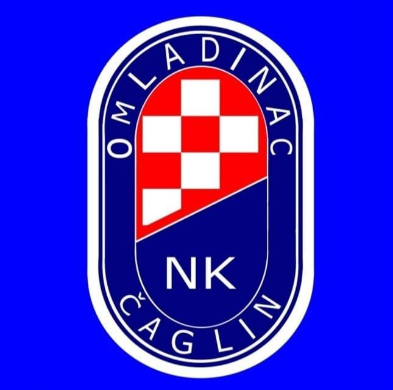
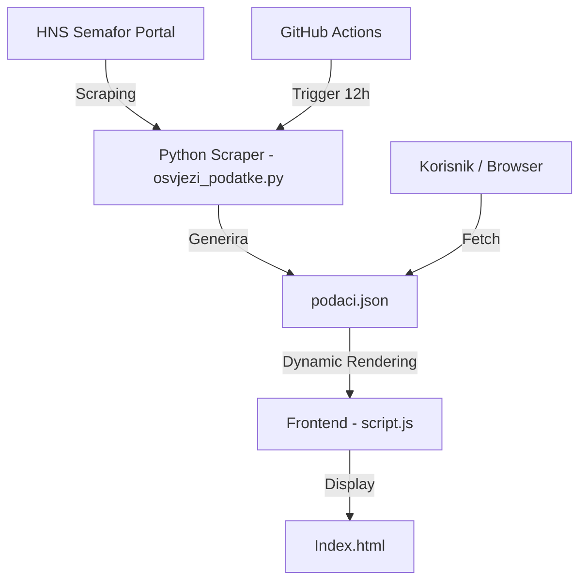

# ⚽ NK Omladinac Čaglin — Službena Web Stranica



Dobrodošli u službeni repozitorij web stranice **NK Omladinac Čaglin**. Ovaj projekt predstavlja spoj strasti prema lokalnom nogometu i moderne tehnologije, s ciljem potpune digitalizacije kluba koji se natječe u **2. Županijskoj nogometnoj ligi Požeško-slavonske županije**.

## 🚀 Ključne Značajke

- **Potpuna Automatizacija Podataka**: Integracija s [HNS Semaforom](https://semafor.hns.family/) omogućuje automatsko ažuriranje ljestvice, rezultata i rasporeda bez ručnog unosa.
- **Dinamički Countdown**: Istaknuta kartica s odbrojavanjem do prve sljedeće utakmice, automatski sinkronizirana s HNS rasporedom.
- **Roster Momčadi**: Prikaz igrača s fotografijama visoke kvalitete i automatskim ažuriranjem postignutih golova tijekom sezone.
- **Premium Dizajn**: Tamna tema s elementima "Glassmorphism" efekata, optimizirana za vrhunsko iskustvo na desktop i mobilnim uređajima.
- **DevOps Integracija**: GitHub Actions svakih 12 sati osvježava cjelokupnu bazu podataka kluba.

---

## 🛠️ Tehnološki Stog

### Frontend
- **HTML5 & Vanilla CSS**: Čista i brza struktura bez suvišnih frameworka.
- **JavaScript (ES6+)**: Dinamička injekcija podataka iz JSON-a, Intersection Observer za animacije, Fetch API za dohvat podataka.

### Backend (Scraper)
- **Python 3**: Jezik za obradu i dohvat podataka.
- **BeautifulSoup4 & Requests**: Napredno struganje podataka s HNS Semafor portala.
- **JSON**: Pohrana podataka u strukturiranom, lakom formatu (`podaci.json`).

### Automatizacija
- **GitHub Actions**: Periodičko pokretanje Python skripte (`osvjezi_podatke.py`) i automatski commit promjena u repozitorij.

---

## 🏗️ Arhitektura Sustava



---

## 💻 Lokalno Pokretanje i Razvoj

Ako želite lokalno testirati ili nadograditi sustav, slijedite ove korake:

### 1. Kloniranje repozitorija
```bash
git clone https://github.com/dlukas99/omladinac-web.git
cd omladinac-web
```

### 2. Instalacija Python ovisnosti
Osigurajte da imate instaliran Python 3.x, zatim instalirajte potrebne biblioteke:
```bash
pip install requests beautifulsoup4
```

### 3. Ručno osvježavanje podataka
Pokrenite scraper kako biste generirali najnoviji `podaci.json`:
```bash
python osvjezi_podatke.py
```

### 4. Pokretanje stranice
Preporučuje se korištenje **Live Server** ekstenzije u VS Code-u ili pokretanje lokalnog Python servera:
```bash
python -m http.server 8000
```
Posjetite `http://localhost:8000`.

---

## 📂 Struktura Mapa

- `images/` — Sve vizualne datoteke (logotipovi, grbovi klubova, fotografije igrača).
- `.github/workflows/` — Konfiguracija za automatiziranu sinkronizaciju podataka.
- `styles.css` — Centralni dizajn sustava s CSS varijablama.
- `script.js` — Glavni "mozak" frontenda koji obrađuje ljestvicu i rezultate.
- `osvjezi_podatke.py` — Python skripta za sinkronizaciju s HNS Semaforom.
- `podaci.json` — Lokalna baza podataka generirana scraperom.

---

## ✒️ Autor
**Domagoj Lukas** — [GitHub Profil](https://github.com/dlukas99)

---
> [!NOTE]
> Podaci o ljestvici i rezultatima su vlasništvo Hrvatskog nogometnog saveza i povlače se isključivo u svrhe informiranja navijača NK Omladinac Čaglin.
